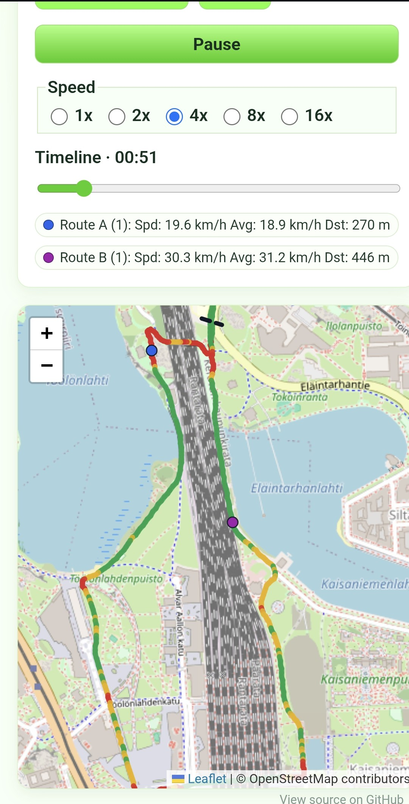

# GPX Route Comparer

Small GitHub Pages web app where you can load up two GPX trails, sync them from a given start line, and then play them back as if you'd taken both routes simultaneously. Allows for one or more samples per route.

## Screenshot 

---
✨ Made with vibes ✨

## Attribution

Based on [GPX Route Comparer](https://github.com/ZeroOne3010/gpx-comparer) by Ville Saalo. Used and modified under the MIT License.
